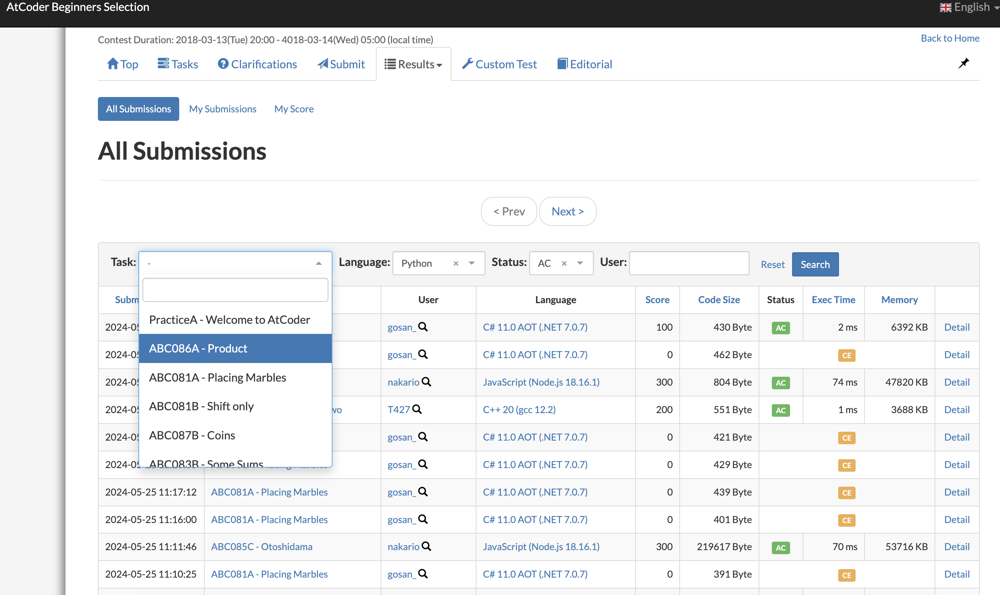

# Beginner Stage

本篇内容建立在你已经熟悉了一些基础语法

## 如果你已经修过数据结构和算法课程

1. [灵茶山艾府基础算法精讲](https://www.youtube.com/watch?v=Woardovr0k0&list=PL5CbbRlzbll9TSV_fbTVSWnZL-RA0IpKt)
   - **Difficulty:** ⭐️⭐️⭐️
   - **Recommendation:** ⭐️⭐️⭐️⭐️⭐️
   - **Note:** 一些同学反应不适合入门，适合有一丢丢算法基础的同学或者复习用。视频使用 Python 讲解，不过你可以在国区的题解里总能找到他用别的语言作的解答。
2. [代码随想录](https://programmercarl.com/)
   - **Difficulty:** ⭐️⭐️
   - **Recommendation:** ⭐️⭐️⭐️⭐️
   - **Note:** 更加容易入手，总体来说是一个不错的材料。但是过于浅，如果灵茶山艾府的材料你觉得过难，可以先尝试这个再用灵茶山艾府的材料进行复习.

在你完成了这两个材料大部分内容后，题量会来到 100-150 之间，会脱离入门阶段。对面试大部分的算法都有一定的了解。

## 如果你没有修过任何数据结构和算法课程

1. [UCB CS61B: Data Structures and Algorithms](https://csdiy.wiki/%E6%95%B0%E6%8D%AE%E7%BB%93%E6%9E%84%E4%B8%8E%E7%AE%97%E6%B3%95/CS61B/)
   - **Difficulty:** ⭐️⭐️⭐️
   - **Recommendation:** ⭐️⭐️⭐️⭐️⭐️
   - **Note:** 如果你把大部分 Lab 都成功完成，你可以跳过上面 2 个刷题 List 中大约三分之一的内容。换句话说，如果你希望搭配上的材料边刷题边学习这门课程，或许你并不需要做完所有 Lab。如果你比较功利，请尽可能跳过所有**非笔试和面试考点**。
2. [Coursera: Algorithms I & II](https://csdiy.wiki/%E6%95%B0%E6%8D%AE%E7%BB%93%E6%9E%84%E4%B8%8E%E7%AE%97%E6%B3%95/Algo/)
   - **Difficulty:** ⭐️⭐️⭐️⭐️
   - **Recommendation:** ⭐️⭐️⭐️⭐️⭐️
   - **Note:** 关于 Lab 的认知同上。配合[课本](https://algs4.cs.princeton.edu/home/)食用效果更佳。如果你比较功利，请尽可能跳过所有**非笔试和面试考点**。特别是 Part II 中的网络流，以及除了 Rabin-Karp 以外的字符串算法。甚至 KMP 也可以跳过。

:::tip ACM 模式

有一个额外的事情我觉得很有必要提一下。有个别公司的 OA，会要求你做最基本的输入输出。其实国内大部分公司都是这个模式，我们称之为 ACM 模式。该名称来自于 ACM（现 ICPC）比赛的读取数据的格式。因此熟悉一下自己语言的输入输出是很有必要的。事实上，现在市面上的绝大多数的算法竞赛网站都是使用了这个模式。

你可以在 [Atcoder Beginner Section](https://atcoder.jp/contests/abs/tasks?lang=en) 简单练习一下自己常用语言的输入和输出。你可以通过下图的位置找到别人的答案来参考。题目本身都很简单，主要是练习一下这个模式。

:::
